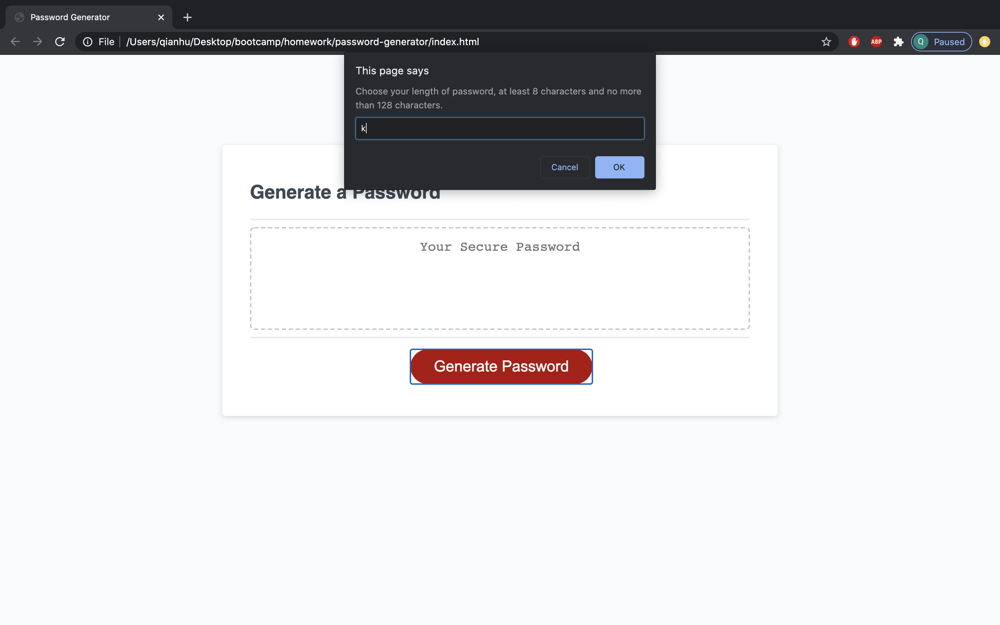
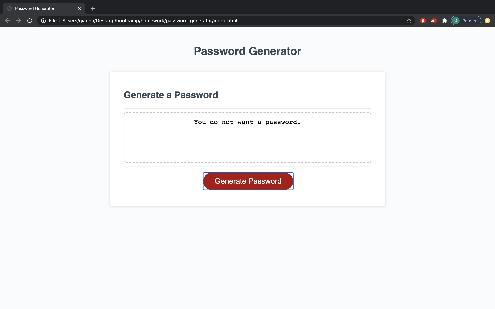
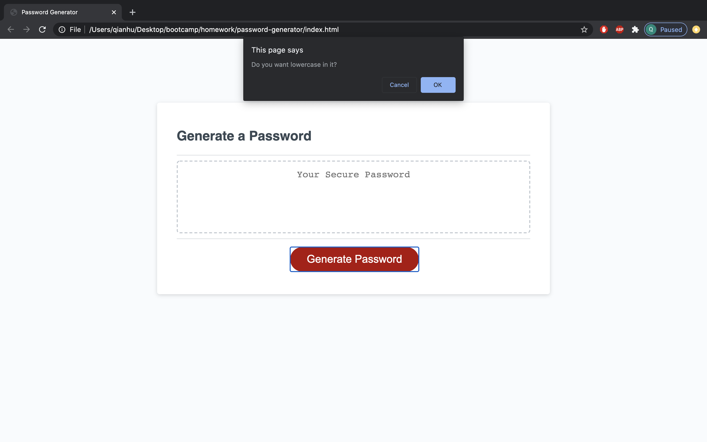
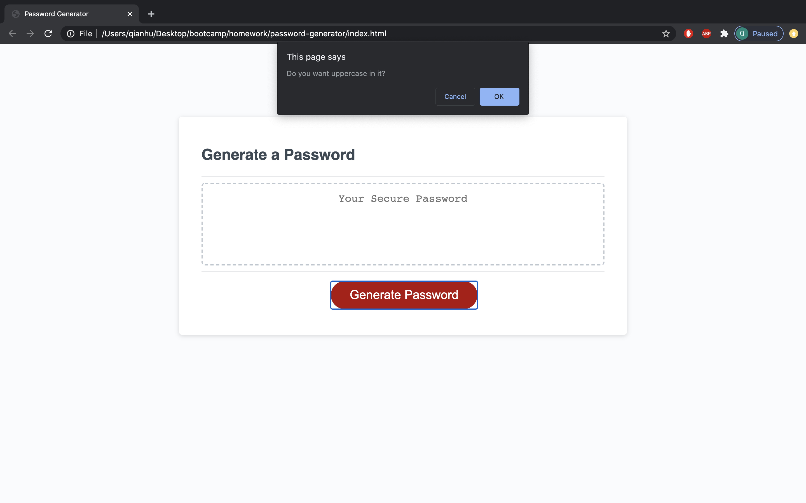
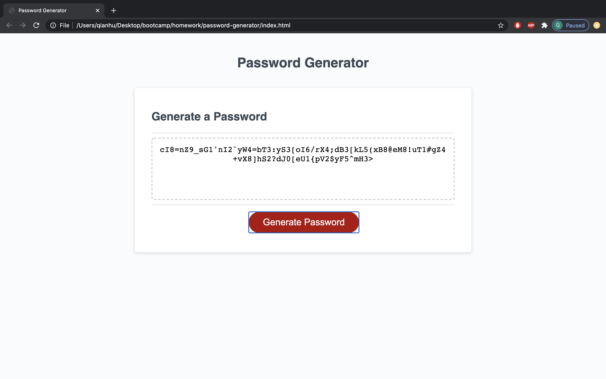

## Student name: 
Qian Hu

## Instructor: 
Emmanuel Jucaban

## Github links:
https://github.com/huqian301/password-generator <br>
https://huqian301.github.io/password-generator/

## Project description: 
In this project, we are creating a app to give user a random password.<br>
Once, user cilck the "Generate Password", there're serverals windows will popout.
Those windows will ask user the length of password they need, and contain lowercase, uppercase, numbers, and special characters or not.<br>
After that, inside of the textbox will show the password that match all the requirements.


## Output
<br>
If the input is not a number or out of range, the window will shows that "Not match the requirement".

<br>
If you don't want to create the password, then textbox will show "You dont want a password".
And, it will not countinuing ask you for the rest of questions.







# 03 JavaScript: Password Generator

Create an application that generates a random password based on user-selected criteria. This app will run in the browser and feature dynamically updated HTML and CSS powered by your JavaScript code. It will also feature a clean and polished user interface and be responsive, ensuring that it adapts to multiple screen sizes.

If you are unfamiliar with special characters, take a look at [some examples](https://www.owasp.org/index.php/Password_special_characters).

## User Story

```
AS AN employee with access to sensitive data
I WANT to randomly generate a password that meets certain criteria
SO THAT I can create a strong password that provides greater security
```

## Acceptance Criteria

```
GIVEN I need a new, secure password
WHEN I click the button to generate a password
THEN I am presented with a series of prompts for password criteria

WHEN prompted for password criteria
THEN I select which criteria to include in the password

WHEN prompted for the length of the password
THEN I choose a length of at least 8 characters and no more than 128 characters

WHEN prompted for character types to include in the password
THEN I choose lowercase, uppercase, numeric, and/or special characters

WHEN I answer each prompt
THEN my input should be validated and at least one character type should be selected

WHEN all prompts are answered
THEN a password is generated that matches the selected criteria

WHEN the password is generated
THEN the password is either displayed in an alert or written to the page
```

The following image demonstrates the application functionality:


## Review

You are required to submit the following for review:

* The URL of the deployed application.

* The URL of the GitHub repository. Give the repository a unique name and include a README describing the project.

- - -
© 2019 Trilogy Education Services, a 2U, Inc. brand. All Rights Reserved.
